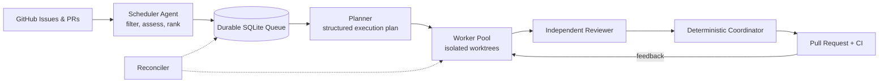

<div align="center">

# Agent-Z

### Turn GitHub issues into reviewed pull requests, continuously.

Agent-Z is an open-source control plane for coding agents. It discovers valuable
work, plans it, runs isolated workers in parallel, reviews the changes, opens
pull requests, watches CI, and recovers interrupted runs.

[](https://github.com/fhwangyinan/agent-z/actions/workflows/ci.yml)
[](https://www.python.org/)
[](https://docs.anthropic.com/en/docs/claude-code)
[](https://openai.com/codex/)
[](https://opencode.ai/)
[](https://coderabbit.ai/)

[Quick Start](#quick-start) · [How It Works](#how-it-works) · [Architecture](#architecture) · [中文文档](README.zh.md)

</div>

---

## Why Agent-Z?

Coding agents are good at solving a task. Running many of them safely across a
real backlog is a different problem.

Agent-Z provides the missing orchestration layer:

| | Capability | What it means |
|---|---|---|
| **Agentic scheduling** | A Scheduler Agent evaluates and ranks real issues | Tracking issues, vague requests, active work, and low-value tasks stay out of the queue |
| **Parallel execution** | Workers use isolated branches and Git worktrees | Independent issues can move at the same time without sharing a working tree |
| **Conflict avoidance** | Issue, file, and module-level claims protect active work | Workers defer overlapping changes instead of racing each other |
| **End-to-end delivery** | Plan, develop, review, submit, watch CI, fix, repeat | The unit of work is a reviewed pull request, not a code snippet |
| **Durable recovery** | SQLite state, leases, heartbeats, retries, and reconciliation | Interrupted planning is requeued; abandoned development is surfaced for inspection |
| **Backend freedom** | Claude Code, Codex, and OpenCode share one runner contract | Use one backend everywhere or mix a Task Lead with an independent Reviewer |

## One Command, Full Pipeline

```bash
python run.py --serve
```

This starts a Scheduler, Planner, Reconciler, and a configurable Worker pool.
The full-screen TUI keeps processes, tasks, events, timings, and live log tails
in one place.

```text
┌ Agent-Z Service ─────────────────────────────────────────────────────┐
│ Processes          Tasks                  Selected task / live log   │
│ ● scheduler        #123 planning          stage, lease, events       │
│ ● planner          #118 developing        expandable log tail        │
│ ● worker-1         #104 waiting_checks                               │
│ ● reconciler                                                        │
└─────────────────────────────────────────────────────────────────────┘
```

Use `Tab` to switch panes, `j/k` or arrow keys to select, `Enter` or `Space` to
expand, and `o` to open the selected task's PR or issue. Press `c` twice to
cancel the selected task, `r` twice to restart the selected process, or `q`
twice to stop all services. Dangerous actions require the matching key again
within five seconds. Child logs are preserved under `.agent-z/logs/`.

## How It Works



1. **Discover**: cheap safety gates remove assigned, blocked, active, duplicate,
   and dependency-blocked issues.
2. **Prioritize**: the Scheduler Agent inspects candidate issue numbers on
   GitHub, rejects non-deliverable work, and ranks expected value.
3. **Plan**: the Task Lead creates a persisted, structured execution plan.
4. **Isolate**: a Worker claims issue and module resources, then creates a
   dedicated branch and worktree.
5. **Build and review**: development continues in the Task Lead session; an
   independent Reviewer sends findings back for fixes.
6. **Deliver**: a deterministic Coordinator commits, pushes, opens the PR,
   watches checks, and loops on actionable feedback.
7. **Recover**: the Reconciler requeues expired planning leases and quarantines
   abandoned development as `needs_human`.

The Scheduler Agent is called only when the candidate snapshot changes or the
queue needs replenishment. Open PRs are fetched once per scan, reducing API
traffic and agent token use.

## Quick Start

### Requirements

- Python 3.11+
- Authenticated [GitHub CLI](https://cli.github.com/): `gh auth login`
- At least one installed agent CLI: `claude`, `codex`, or `opencode`
- Optional: the [CodeRabbit](https://coderabbit.ai/) GitHub App

### Install

```bash
git clone https://github.com/fhwangyinan/agent-z.git
cd agent-z

python -m venv .venv
source .venv/bin/activate       # Linux/macOS
# .venv\Scripts\activate        # Windows PowerShell

pip install -r requirements.txt
cp .env.example .env
```

Set the target project and repository in `.env`:

```env
PROJECT_DIR=/path/to/your/project
GITHUB_REPO=owner/repository

DEFAULT_BACKEND=claude
# TASK_LEAD_BACKEND=claude
# REVIEWER_BACKEND=codex
```

Then start the service:

```bash
python run.py --serve
```

## Designed for Real Repositories

### Semantic scheduling, deterministic safety

The Scheduler Agent decides which work is valuable; deterministic checks decide
what is safe to consider. It skips assigned issues, active-work labels, related
open PRs, and open dependencies declared as `Blocked by #123`, `Depends on
#123`, or `Requires #123`.

Candidate `updatedAt`, open-PR state, and queue state are persisted. Unchanged
backlogs do not repeatedly invoke the Agent. New enqueue decisions fail closed
when GitHub state is unavailable, while transient query failures do not cancel
already queued work.

### Parallel without pretending conflicts do not exist

Every run gets a unique ID, branch, worktree, plan, workflow stage, and role
lease. SQLite provides atomic queue claims and issue locks. Predicted files,
actual changed files, and conservative module resources reduce collisions
between parallel Workers.

Agent-Z also rechecks GitHub immediately before development to avoid duplicating
work started by another person or automation. For strict cross-machine
mutual exclusion, pair Agent-Z with a repository-side lock or GitHub Action.

### Failures are workflow states

GitHub and network operations use bounded retries with exponential backoff.
Planner failures can be retried, service subprocesses restart behind a circuit
breaker, lease loss is propagated to the owning process, and structured events
make unattended runs inspectable.

## Everyday Commands

```bash
python run.py --serve              # Start the complete autonomous service
python run.py --serve --workers 4  # Start with four Workers
python run.py --issue 123          # Run one issue unattended
python run.py --enqueue 123        # Add an issue to the durable queue
python run.py --list-runs          # List recent and active runs
python run.py --inspect RUN_ID     # Show plan, state, and event timeline
python run.py --resume RUN_ID      # Resume an interrupted run
python run.py --cancel RUN_ID      # Cancel an abandoned run safely
python run.py --help-all           # Show pool-level and tuning commands
```

<details>
<summary><strong>All operation modes</strong></summary>

| Command | Purpose |
|---|---|
| `python run.py` | Interactive issue selection, impact Q&A, and development |
| `python run.py --loop N` | Run N autonomous rounds |
| `python run.py --loop N --force` | Include high-risk issues |
| `python run.py --planner` | Continuously plan queued issues |
| `python run.py --worker` | Continuously execute ready tasks |
| `python run.py --scheduler` | Continuously discover and enqueue work |
| `python run.py --schedule-once` | Run one scheduling scan |
| `python run.py --reconciler` | Continuously recover expired leases |
| `python run.py --reconcile-once` | Run one recovery scan |
| `python run.py --plan-next` | Plan the oldest queued issue once |
| `python run.py --run-next` | Execute the oldest ready task once |

Planner and Worker processes can be scaled independently.

</details>

## Architecture

```text
run.py                    CLI entry point
config.py                 Environment-backed configuration
orchestration/
  scheduler.py            Safety filtering, snapshots, Agent scheduling
  store.py                SQLite queue, state, leases, and resource claims
  workflow.py             Planning and task execution state machine
  service.py              Full-service supervisor and restart circuit breaker
  tui.py                  Rich live dashboard and run inspection
  github_ops.py           GitHub queries, preflight, retries, and cleanup
  submission.py           Deterministic commit, push, PR creation, adoption
  worktree.py             Isolated Git worktree lifecycle
  pools.py                Scheduler, Planner, Worker, and Reconciler loops
agents/
  scheduler.py            Semantic issue assessment and ranking
  analyst.py              Task Lead planning and impact analysis
  developer.py            Implementation and review-feedback handling
  reviewer.py             Independent local code review
  runners/                Claude Code, Codex, and OpenCode adapters
```

The Task Lead shares context across planning and development. The Reviewer uses
an independent session. Lifecycle operations that must be predictable, such as
claiming work, committing, pushing, and creating PRs, stay deterministic.

## Observability

- Full-screen process/task dashboard with stable selection and expandable logs
- Live elapsed time for agent calls, waits, checks, and restarts
- Structured SQLite event history for every run and global service events
- Color-coded run list with status, stage, lease, age, PR, and errors
- Rotating per-process logs under `.agent-z/logs/`

```bash
python run.py --list-runs
python run.py --inspect RUN_ID
```

## CI and Automated Review

The included GitHub Actions workflow runs tests on Python 3.11, 3.12, and 3.13
plus a compile check. Actions are pinned to immutable SHAs and use read-only
repository permissions.

`.coderabbit.yaml` configures automated reviews focused on state transitions,
SQLite atomicity, concurrency, recovery, external CLI calls, and test coverage.
Install the CodeRabbit GitHub App to enable it; no repository secret is needed.

<details>
<summary><strong>Configuration reference</strong></summary>

Copy `.env.example` to `.env`. The template documents every supported option.
The most commonly tuned values are:

| Variable | Purpose | Default |
|---|---|---|
| `PROJECT_DIR` | Target project path | required |
| `GITHUB_REPO` | Target repository in `owner/repo` form | required |
| `DEFAULT_BACKEND` | Default agent backend | `claude` |
| `TASK_LEAD_BACKEND` | Planning and development backend | default backend |
| `REVIEWER_BACKEND` | Independent review backend | default backend |
| `MAX_PARALLEL_TASKS` | Maximum active tasks | `2` |
| `SERVICE_WORKERS` | Workers started by `--serve` | max parallel tasks |
| `SCHEDULER_BATCH_SIZE` | Maximum issues enqueued per scan | `10` |
| `SCHEDULER_ELIGIBLE_LABELS` | Required scheduling labels; empty allows all | empty |
| `SCHEDULER_BLOCK_LABELS` | Labels that block scheduling | `blocked` |
| `SKIP_LABELS` | Active-work labels; first is applied before development | `ongoing` |
| `GITHUB_RETRY_ATTEMPTS` | GitHub/Git network operation attempts | `3` |
| `MAX_REVIEW_ROUNDS` | Maximum remote review-fix loops | `5` |

See [`.env.example`](.env.example) for the complete list.

</details>

## Project Status

Agent-Z is actively evolving. It is designed for repositories where agent CLIs
are already trusted to edit code and where maintainers want a durable,
observable workflow around them. Review the default backend flags and start with
a constrained repository or eligible label before enabling broad scheduling.

---

<div align="center">

Built for teams that want coding agents to finish the workflow, not just start it.

</div>
