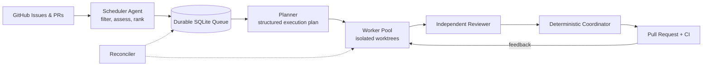

<div align="center">

# Agent-Z

<<<<<<< Updated upstream
[中文文档](README.zh.md)
=======
### Turn GitHub issues into reviewed pull requests, continuously.

Agent-Z is an open-source control plane for coding agents. It discovers valuable
work, plans it, runs isolated workers in parallel, reviews the changes, opens
pull requests, watches CI, and recovers interrupted runs.

[](https://github.com/fhwangyinan/agent-z/actions/workflows/ci.yml)
[](https://www.python.org/)
[](https://docs.anthropic.com/en/docs/claude-code)
[](https://openai.com/codex/)
[](https://opencode.ai/)
[](https://coderabbit.ai/)

[Quick Start](#quick-start) · [How It Works](#how-it-works) · [Architecture](#architecture) · [中文文档](README.zh.md)
>>>>>>> Stashed changes

</div>

---

## Why Agent-Z?

Coding agents are good at solving a task. Running many of them safely across a
real backlog is a different problem.

Agent-Z provides the missing orchestration layer:

| | Capability | What it means |
|---|---|---|
| **Agentic scheduling** | A Scheduler Agent evaluates and ranks real issues | Tracking issues, vague requests, active work, and low-value tasks stay out of the queue |
| **Parallel execution** | Workers use isolated branches and Git worktrees | Independent issues can move at the same time without sharing a working tree |
| **Conflict avoidance** | Issue, file, and module-level claims protect active work | Workers defer overlapping changes instead of racing each other |
| **End-to-end delivery** | Plan, develop, review, submit, watch CI, fix, repeat | The unit of work is a reviewed pull request, not a code snippet |
| **Durable recovery** | SQLite state, leases, heartbeats, retries, and reconciliation | Interrupted planning is requeued; abandoned development is surfaced for inspection |
| **Backend freedom** | Claude Code, Codex, and OpenCode share one runner contract | Use one backend everywhere or mix a Task Lead with an independent Reviewer |

## One Command, Full Pipeline

```bash
python run.py --serve
```

This starts a Scheduler, Planner, Reconciler, and a configurable Worker pool.
The full-screen TUI keeps processes, tasks, events, timings, and live log tails
in one place.

```text
┌ Agent-Z Service ─────────────────────────────────────────────────────┐
│ Processes          Tasks                  Selected task / live log   │
│ ● scheduler        #123 planning          stage, lease, events       │
│ ● planner          #118 developing        expandable log tail        │
│ ● worker-1         #104 waiting_checks                               │
│ ● reconciler                                                        │
└─────────────────────────────────────────────────────────────────────┘
```

Use `Tab` to switch panes, `j/k` or arrow keys to select, `Enter` or `Space` to
expand, and `q` to stop the service. Child logs are preserved under
`.agent-z/logs/`.

## How It Works



1. **Discover**: cheap safety gates remove assigned, blocked, active, duplicate,
   and dependency-blocked issues.
2. **Prioritize**: the Scheduler Agent inspects candidate issue numbers on
   GitHub, rejects non-deliverable work, and ranks expected value.
3. **Plan**: the Task Lead creates a persisted, structured execution plan.
4. **Isolate**: a Worker claims issue and module resources, then creates a
   dedicated branch and worktree.
5. **Build and review**: development continues in the Task Lead session; an
   independent Reviewer sends findings back for fixes.
6. **Deliver**: a deterministic Coordinator commits, pushes, opens the PR,
   watches checks, and loops on actionable feedback.
7. **Recover**: the Reconciler requeues expired planning leases and quarantines
   abandoned development as `needs_human`.

The Scheduler Agent is called only when the candidate snapshot changes or the
queue needs replenishment. Open PRs are fetched once per scan, reducing API
traffic and agent token use.

## Quick Start

### Requirements

- Python 3.11+
- Authenticated [GitHub CLI](https://cli.github.com/): `gh auth login`
- At least one installed agent CLI: `claude`, `codex`, or `opencode`
- Optional: the [CodeRabbit](https://coderabbit.ai/) GitHub App

### Install

```bash
git clone https://github.com/fhwangyinan/agent-z.git
cd agent-z

python -m venv .venv
source .venv/bin/activate       # Linux/macOS
# .venv\Scripts\activate        # Windows PowerShell

pip install -r requirements.txt
cp .env.example .env
```

Set the target project and repository in `.env`:

```env
PROJECT_DIR=/path/to/your/project
GITHUB_REPO=owner/repository

DEFAULT_BACKEND=claude
# TASK_LEAD_BACKEND=claude
# REVIEWER_BACKEND=codex
```

Then start the service:

```bash
python run.py --serve
```

<<<<<<< Updated upstream
`--serve` starts one Scheduler, one Planner, one Reconciler, and
`SERVICE_WORKERS` Worker processes. Crashed child processes use exponential
restart backoff and open a circuit after repeated failures, and
`Ctrl+C` stops the complete service. Use `--serve --workers 4` to override the
Worker count and set that service's task concurrency to four. Default `--help`
shows normal commands only; use `--help-all` for pool-level and tuning options.

`--serve` uses a full-screen dashboard instead of streaming every child-process
message into the terminal. It shows process health, recent tasks, selected
details, and recent structured events. Use `Tab` to switch between Processes
and Tasks, `Up/Down` or `j/k` to select, `Enter` or `Space` to expand task
details or a live process log tail, and `q` to stop the service. Task selection
stays stable when new runs arrive. Detailed child output is preserved in
`.agent-z/logs/<process>.log`.

### CI and CodeRabbit

GitHub Actions runs the unit test suite on Python 3.11, 3.12, and 3.13, plus a
separate compile check. The workflow uses read-only repository permissions and
can be required in the `main` branch protection rules.

The repository also includes `.coderabbit.yaml` for automatic Chinese-language
reviews focused on workflow state, concurrency, recovery, external CLI calls,
and test coverage. To enable reviews, install the CodeRabbit GitHub App for this
repository at [coderabbit.ai](https://coderabbit.ai/). No repository secret is
required for the standard GitHub App integration.

The remaining commands are intended for single-task operation, diagnostics, or
independent scaling:
=======
## Designed for Real Repositories

### Semantic scheduling, deterministic safety

The Scheduler Agent decides which work is valuable; deterministic checks decide
what is safe to consider. It skips assigned issues, active-work labels, related
open PRs, and open dependencies declared as `Blocked by #123`, `Depends on
#123`, or `Requires #123`.

Candidate `updatedAt`, open-PR state, and queue state are persisted. Unchanged
backlogs do not repeatedly invoke the Agent. New enqueue decisions fail closed
when GitHub state is unavailable, while transient query failures do not cancel
already queued work.

### Parallel without pretending conflicts do not exist

Every run gets a unique ID, branch, worktree, plan, workflow stage, and role
lease. SQLite provides atomic queue claims and issue locks. Predicted files,
actual changed files, and conservative module resources reduce collisions
between parallel Workers.

Agent-Z also rechecks GitHub immediately before development to avoid duplicating
work started by another person or automation. For strict cross-machine
mutual exclusion, pair Agent-Z with a repository-side lock or GitHub Action.

### Failures are workflow states

GitHub and network operations use bounded retries with exponential backoff.
Planner failures can be retried, service subprocesses restart behind a circuit
breaker, lease loss is propagated to the owning process, and structured events
make unattended runs inspectable.

## Everyday Commands
>>>>>>> Stashed changes

```bash
python run.py --serve              # Start the complete autonomous service
python run.py --serve --workers 4  # Start with four Workers
python run.py --issue 123          # Run one issue unattended
python run.py --enqueue 123        # Add an issue to the durable queue
python run.py --list-runs          # List recent and active runs
python run.py --inspect RUN_ID     # Show plan, state, and event timeline
python run.py --resume RUN_ID      # Resume an interrupted run
python run.py --cancel RUN_ID      # Cancel an abandoned run safely
python run.py --help-all           # Show pool-level and tuning commands
```

<details>
<summary><strong>All operation modes</strong></summary>

<<<<<<< Updated upstream
GitHub remains the shared coordination source. Before Agent assessment, the
scheduler skips assigned issues, active-work labels, related open PRs, and
same-repository dependencies declared with `Blocked by #123`, `Depends on
#123`, or `Requires #123`. The Scheduler Agent receives only the candidate issue
numbers and inspects their current GitHub state itself. Agent decisions are
fail-closed and recorded in the event log.
Open PRs are fetched once per Scheduler scan and mapped to exact Issue
references instead of issuing one PR query per candidate.

Each cheap Scheduler scan persists a repository snapshot containing candidate
issue `updatedAt` values, related open-PR state, and queue statuses. The
Scheduler Agent runs only on the first scan, when that candidate snapshot
changes, or when queued work has been consumed and the queue needs
replenishment. A replenishment fills only up to `SCHEDULER_BATCH_SIZE`; an
unchanged underfilled queue is not repeatedly re-evaluated.
Previously Scheduler-enqueued tasks that have not been claimed by a Planner are
also re-evaluated, while manually enqueued and already claimed tasks are left
untouched.

Workers claim both predicted files and conservative module resources before
development, reducing conflicts between parallel tasks that touch different
files in the same module. Transient Planner failures are automatically retried
with exponential backoff.

`--cancel` refuses to remove a task that is still owned by a live Agent-Z process. Use it for queued, stopped, or abandoned runs.

Run each pool in separate processes and scale them independently:

```bash
python run.py --planner
python run.py --worker
python run.py --worker
python run.py --reconciler
```

### TUI Observability

The terminal output is designed to remain useful both interactively and in unattended logs:

- Every major stage displays the full Run ID, Issue number, status, stage, lease role, and cumulative elapsed time.
- Agent calls report backend/session mode and execution time.
- Worker, Planner, Scheduler, and Reconciler idle countdowns refresh in place instead of appending heartbeat lines.
- `--serve` displays a full-screen selectable process/task dashboard with expandable live log tails; child output is written to `.agent-z/logs/`.
- Agent calls show live elapsed time; PR check registration, check watching, and service restarts show dynamic timing status.
- PR checks render as a result table with total wait time.
- Completed, skipped, failed, interrupted, and `needs_human` runs render consistent terminal summaries.
- `--list-runs` shows a color-coded status overview, run age, leases, PRs, and errors.
- `--inspect RUN_ID` shows runtime details, the persisted plan, and an event timeline with relative timestamps.

### Interactive Mode

- Let the agent auto-recommend an issue, or specify one by number
- Review impact assessment and Q&A with the Analyst
- Type `skip` to move on, `done` or Enter to start development

### Autonomous Mode

- Agent auto-recommends and fixes issues without prompts
- Risk assessment: issues rated **high / very_high** are skipped (unless `--force` is used)
- Available flags:

| Flag | Effect |
|------|--------|
| `--serve` | Start the complete Scheduler, Planner, Worker, and Reconciler service |
| `--workers N` | Set the Worker count started by `--serve` |
| `--loop N` | Run N rounds automatically |
| `--force` | Ignore risk levels, develop all issues |
| `--issue N` | Run one issue immediately |
| `--enqueue N` | Add an issue to the SQLite queue |
| `--plan-next` | Plan the oldest queued issue once |
| `--run-next` | Claim the oldest planned, ready task when a slot is available |
| `--resume RUN_ID` | Resume a failed or interrupted task |
| `--inspect RUN_ID` | Show persisted metadata and structured event history |
| `--planner` | Run one independently scalable Planner process |
| `--worker` | Run one independently scalable development Worker |
| `--reconciler` | Recover expired Planner/Worker leases continuously |
| `--reconcile-once` | Recover expired leases once |
| `--worker-max-runs N` | Stop worker after N claimed runs (`0` = forever) |
| `--keep-worktree` | Keep a completed task's worktree |

## Workflow

Each round:

1. **Queue Issue** — Persist an issue in the planning queue.
2. **Task Lead Planning** — Explore relevant open issues/PRs on demand, analyze the issue, assess impact, publish a human-readable issue comment, and persist a versioned structured execution plan.
   - `very_low` — no impact
   - `low` — minor impact
   - `medium` — moderate impact
   - `high` — significant (behavior/API changes) → auto-skipped
   - `very_high` — destructive (alters workflows/outputs) → auto-skipped
   - If an assessment already exists, updates it rather than creating a duplicate
3. **Q&A** (interactive only) — Discuss impacts with the Analyst; `skip` to move on
4. **Worker Preflight** — Re-check issue state, labels, related PRs, plan freshness, and predicted file conflicts.
5. **Mark Claimed** — Add the first `SKIP_LABELS` label before development starts
6. **Isolate** — Create a dedicated branch and Git worktree for the run
7. **Develop** — Continue in the same Task Lead session and fix code in the isolated worktree
8. **Review** — Independent local review; findings are explicitly handed back to Developer
9. **Submit** — The Coordinator deterministically commits, pushes, opens, and verifies the PR
10. **PR Checks** — Wait for all checks with `gh pr checks --watch` → Developer reads CI and review feedback → fixes → local Reviewer validates → push → repeat until no action is needed
=======
| Command | Purpose |
|---|---|
| `python run.py` | Interactive issue selection, impact Q&A, and development |
| `python run.py --loop N` | Run N autonomous rounds |
| `python run.py --loop N --force` | Include high-risk issues |
| `python run.py --planner` | Continuously plan queued issues |
| `python run.py --worker` | Continuously execute ready tasks |
| `python run.py --scheduler` | Continuously discover and enqueue work |
| `python run.py --schedule-once` | Run one scheduling scan |
| `python run.py --reconciler` | Continuously recover expired leases |
| `python run.py --reconcile-once` | Run one recovery scan |
| `python run.py --plan-next` | Plan the oldest queued issue once |
| `python run.py --run-next` | Execute the oldest ready task once |

Planner and Worker processes can be scaled independently.

</details>
>>>>>>> Stashed changes

## Architecture

```text
run.py                    CLI entry point
config.py                 Environment-backed configuration
orchestration/
  scheduler.py            Safety filtering, snapshots, Agent scheduling
  store.py                SQLite queue, state, leases, and resource claims
  workflow.py             Planning and task execution state machine
  service.py              Full-service supervisor and restart circuit breaker
  tui.py                  Rich live dashboard and run inspection
  github_ops.py           GitHub queries, preflight, retries, and cleanup
  submission.py           Deterministic commit, push, PR creation, adoption
  worktree.py             Isolated Git worktree lifecycle
  pools.py                Scheduler, Planner, Worker, and Reconciler loops
agents/
  scheduler.py            Semantic issue assessment and ranking
  analyst.py              Task Lead planning and impact analysis
  developer.py            Implementation and review-feedback handling
  reviewer.py             Independent local code review
  runners/                Claude Code, Codex, and OpenCode adapters
```

The Task Lead shares context across planning and development. The Reviewer uses
an independent session. Lifecycle operations that must be predictable, such as
claiming work, committing, pushing, and creating PRs, stay deterministic.

## Observability

- Full-screen process/task dashboard with stable selection and expandable logs
- Live elapsed time for agent calls, waits, checks, and restarts
- Structured SQLite event history for every run and global service events
- Color-coded run list with status, stage, lease, age, PR, and errors
- Rotating per-process logs under `.agent-z/logs/`

<<<<<<< Updated upstream
Completed and cancelled runs remove their owned active-work label and clean their worktree. Failed and `needs_human` runs keep the branch, label, and worktree by default for recovery; leases are still released. Set `CLEANUP_FAILED_WORKTREES=true` to remove failed worktrees while preserving the branch and active-work label.

Routine discovery queries are open-only: issue selection lists open issues and open PRs, Worker preflight checks related open PRs, and submission recovery adopts only open PRs from the task branch. Closed and merged history is queried only by explicit item URL when a known PR must be inspected.

The Task Lead explores open issues and open PRs only when needed using targeted, paginated queries. The Coordinator does not inject a backlog snapshot into prompts, preserving flexible exploration without repeatedly loading repository-wide state.

Structured run events are stored in SQLite for queue, worker, stage, status, resume, cancel, skip-label, and file-claim transitions. Use `python run.py --inspect RUN_ID` to review the timeline when a remote or unattended run needs diagnosis.

## Configuration

Copy `.env.example` to `.env` and edit. Full options:

| Variable | Description | Default |
|----------|-------------|---------|
| `PROJECT_DIR` | Target project path | — |
| `GITHUB_REPO` | Target repo (owner/repo) | — |
| `SKIP_LABELS` | Comma-separated labels to skip; the first label is added before development | `ongoing` |
| `AGENT_Z_HOME` | Runtime state directory | `.agent-z` |
| `STATE_DB` | SQLite state database | `.agent-z/state.db` |
| `WORKTREE_ROOT` | Isolated worktree directory | `.agent-z/worktrees` |
| `DEFAULT_BACKEND` | Default backend: `claude`, `codex`, or `opencode` | `claude` |
| `TASK_LEAD_BACKEND` | Shared issue selection, planning, and development backend | `ANALYST_BACKEND` or `DEFAULT_BACKEND` |
| `REVIEWER_BACKEND` | Reviewer backend override | `DEFAULT_BACKEND` |
| `CLAUDE_FLAGS` | Claude Code flags | `--dangerously-skip-permissions` |
| `CODEX_FLAGS` | Codex CLI flags | `--dangerously-bypass-approvals-and-sandbox` |
| `OPENCODE_FLAGS` | OpenCode CLI flags | — |
| `TIMEOUT_ANALYST` | Analyst timeout (s) | 3600 |
| `TIMEOUT_DEVELOPER` | Developer timeout (s) | 10800 |
| `TIMEOUT_REVIEWER` | Reviewer timeout (s) | 1800 |
| `RETRY_TIMEOUT` | Retry timeout (s) | 3600 |
| `GITHUB_RETRY_ATTEMPTS` | Maximum attempts for GitHub CLI and explicit network Git operations | 3 |
| `GITHUB_RETRY_BASE_DELAY` | Initial transient-failure retry delay (s) | 2 |
| `GITHUB_RETRY_MAX_DELAY` | Maximum exponential backoff delay (s) | 30 |
| `GITHUB_COMMAND_TIMEOUT` | Per-command timeout for GitHub/Git network calls without an explicit timeout (s) | 60 |
| `PR_CHECKS_INTERVAL` | PR checks watch interval (s) | 10 |
| `PR_CHECKS_MAX_WAIT` | Max wait for PR checks (s) | 900 |
| `MAX_REVIEW_ROUNDS` | Max review-fix loops | 5 |
| `MAX_LOCAL_REVIEW_ROUNDS` | Max local review loops | 5 |
| `MAX_PARALLEL_TASKS` | Maximum active tasks across processes | 2 |
| `SERVICE_WORKERS` | Default Worker count for `--serve` | `MAX_PARALLEL_TASKS` |
| `SERVICE_RESTART_DELAY` | Delay before restarting a crashed service child (s) | 5 |
| `SERVICE_RESTART_MAX_DELAY` | Maximum exponential child restart delay (s) | 60 |
| `SERVICE_RESTART_MAX_ATTEMPTS` | Consecutive restart attempts before opening the circuit | 5 |
| `SERVICE_RESTART_RESET_SECONDS` | Healthy runtime required to reset restart failures (s) | 300 |
| `SERVICE_LOG_MAX_BYTES` | Rotate each service child log after this many bytes | 5242880 |
| `SERVICE_LOG_BACKUPS` | Number of rotated service logs to retain | 3 |
| `MAX_RUN_SECONDS` | Per-attempt runtime budget | 21600 |
| `CLEANUP_COMPLETED_WORKTREES` | Remove worktrees after successful completion | `true` |
| `CLEANUP_FAILED_WORKTREES` | Remove failed/needs-human worktrees while preserving branch and label | `false` |
| `WORKER_IDLE_SLEEP` | Queue worker sleep when no task is available | 30 |
| `WORKER_PREFLIGHT_MAX_RETRIES` | Preflight failures before a task needs human attention | 3 |
| `PLANNER_IDLE_SLEEP` | Planner sleep when no issue awaits analysis | 30 |
| `PLANNER_MAX_RETRIES` | Maximum attempts for transient Planner failures | 3 |
| `PLANNER_RETRY_BASE_DELAY` | Initial Planner retry delay (s) | 10 |
| `SCHEDULER_IDLE_SLEEP` | Seconds between Scheduler scans | 60 |
| `SCHEDULER_BATCH_SIZE` | Maximum Agent-approved issues enqueued per scan | 10 |
| `SCHEDULER_ISSUE_LIMIT` | Maximum open issues fetched per scan | 100 |
| `SCHEDULER_PR_LIMIT` | Maximum open PRs fetched once per scan | 500 |
| `SCHEDULER_AGENT_CANDIDATE_LIMIT` | Maximum hard-filtered candidates assessed by the Scheduler Agent per scan | `SCHEDULER_ISSUE_LIMIT` |
| `SCHEDULER_ELIGIBLE_LABELS` | Required scheduling labels; empty allows all open issues | — |
| `SCHEDULER_BLOCK_LABELS` | Labels that prevent automatic scheduling | `blocked` |
| `SCHEDULER_SKIP_ASSIGNED_ISSUES` | Skip issues with assignees | `true` |
| `SCHEDULER_PRIORITY_LABELS` | Label hints used to build the Agent candidate shortlist | `priority:critical,...` |
| `RECONCILER_INTERVAL` | Seconds between expired-lease scans | 60 |
| `PLANNER_LEASE_SECONDS` | Planner claim lifetime | 7200 |
| `WORKER_LEASE_SECONDS` | Worker claim lifetime | 21600 |

Legacy variables `CODERABBIT_POLL_INTERVAL` and `CODERABBIT_MAX_WAIT` remain supported as fallbacks.

## Backend Selection

Use one backend for every role:

```env
DEFAULT_BACKEND=codex
=======
```bash
python run.py --list-runs
python run.py --inspect RUN_ID
>>>>>>> Stashed changes
```

## CI and Automated Review

The included GitHub Actions workflow runs tests on Python 3.11, 3.12, and 3.13
plus a compile check. Actions are pinned to immutable SHAs and use read-only
repository permissions.

`.coderabbit.yaml` configures automated reviews focused on state transitions,
SQLite atomicity, concurrency, recovery, external CLI calls, and test coverage.
Install the CodeRabbit GitHub App to enable it; no repository secret is needed.

<details>
<summary><strong>Configuration reference</strong></summary>

Copy `.env.example` to `.env`. The template documents every supported option.
The most commonly tuned values are:

| Variable | Purpose | Default |
|---|---|---|
| `PROJECT_DIR` | Target project path | required |
| `GITHUB_REPO` | Target repository in `owner/repo` form | required |
| `DEFAULT_BACKEND` | Default agent backend | `claude` |
| `TASK_LEAD_BACKEND` | Planning and development backend | default backend |
| `REVIEWER_BACKEND` | Independent review backend | default backend |
| `MAX_PARALLEL_TASKS` | Maximum active tasks | `2` |
| `SERVICE_WORKERS` | Workers started by `--serve` | max parallel tasks |
| `SCHEDULER_BATCH_SIZE` | Maximum issues enqueued per scan | `10` |
| `SCHEDULER_ELIGIBLE_LABELS` | Required scheduling labels; empty allows all | empty |
| `SCHEDULER_BLOCK_LABELS` | Labels that block scheduling | `blocked` |
| `SKIP_LABELS` | Active-work labels; first is applied before development | `ongoing` |
| `GITHUB_RETRY_ATTEMPTS` | GitHub/Git network operation attempts | `3` |
| `MAX_REVIEW_ROUNDS` | Maximum remote review-fix loops | `5` |

See [`.env.example`](.env.example) for the complete list.

</details>

## Project Status

Agent-Z is actively evolving. It is designed for repositories where agent CLIs
are already trusted to edit code and where maintainers want a durable,
observable workflow around them. Review the default backend flags and start with
a constrained repository or eligible label before enabling broad scheduling.

---

<div align="center">

Built for teams that want coding agents to finish the workflow, not just start it.

</div>
