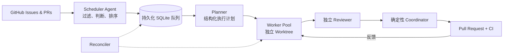

<div align="center">

# Agent-Z

### 持续把 GitHub Issue 变成经过审查的 Pull Request。

Agent-Z 是面向 coding agent 的开源控制平面：自动发现高价值任务、生成计划、
并行隔离开发、独立审查、创建 PR、等待 CI，并从中断中恢复。

[](https://github.com/fhwangyinan/agent-z/actions/workflows/ci.yml)
[](https://www.python.org/)
[](https://docs.anthropic.com/en/docs/claude-code)
[](https://openai.com/codex/)
[](https://opencode.ai/)
[](https://coderabbit.ai/)

[快速开始](#快速开始) · [工作原理](#工作原理) · [架构](#架构) · [English](README.md)

</div>

---

## 为什么需要 Agent-Z？

Coding agent 擅长解决单个任务。让多个 Agent 在真实 backlog 上长期、安全地协作，
则是另一类问题。

Agent-Z 补上了这层调度与治理能力：

| | 能力 | 带来的效果 |
|---|---|---|
| **Agent 语义调度** | Scheduler Agent 判断 Issue 是否值得做、应该先做什么 | Tracking Issue、模糊需求、低收益任务不会粗暴入队 |
| **并行隔离执行** | 每个 Worker 使用独立分支与 Git worktree | 互不依赖的 Issue 可以同时推进 |
| **冲突规避** | Issue、文件与模块级资源声明保护进行中的工作 | 发现潜在重叠时延后任务，而不是让 Worker 相互覆盖 |
| **完整交付闭环** | 规划、开发、审查、提交、等待 CI、修复、再验证 | 最终产物是经过检查的 PR，而不只是一段代码 |
| **持久化恢复** | SQLite 状态、租约、心跳、重试与 Reconciler | 中断的规划可重新排队，废弃开发会进入人工检查 |
| **后端自由组合** | Claude Code、Codex、OpenCode 使用统一 Runner 契约 | 可统一使用一种后端，也可组合 Task Lead 与独立 Reviewer |

## 一条命令，启动完整流水线

```bash
python run.py --serve
```

它会启动 Scheduler、Planner、Reconciler 和可配置的 Worker Pool。全屏 TUI
把进程、任务、事件、耗时和实时日志尾部保持在同一屏中。

```text
┌ Agent-Z Service ─────────────────────────────────────────────────────┐
│ Processes          Tasks                  Selected task / live log   │
│ ● scheduler        #123 planning          stage, lease, events       │
│ ● planner          #118 developing        expandable log tail        │
│ ● worker-1         #104 waiting_checks                               │
│ ● reconciler                                                        │
└─────────────────────────────────────────────────────────────────────┘
```

使用 `Tab` 切换面板，方向键或 `j/k` 选择，`Enter` 或 `Space` 展开详情，
`q` 停止服务。子进程完整日志保存在 `.agent-z/logs/`。

## 工作原理



1. **发现任务**：低成本安全规则排除已分配、已阻塞、正在处理、有重复 PR 或依赖未关闭的 Issue。
2. **语义排序**：Scheduler Agent 自行查看候选 Issue，拒绝不可独立交付的工作，并按预期收益排序。
3. **生成计划**：Task Lead 创建可持久化的结构化执行计划。
4. **隔离执行**：Worker 领取 Issue 与模块资源，并创建专属分支和 worktree。
5. **开发与审查**：Task Lead 延续规划上下文完成开发；独立 Reviewer 将发现反馈给 Developer。
6. **提交交付**：确定性 Coordinator commit、push、创建 PR、等待 checks，并循环处理有效反馈。
7. **故障恢复**：Reconciler 重新排队过期规划租约，并把废弃开发标记为 `needs_human`。

只有候选快照变化或队列需要补位时才会调用 Scheduler Agent。每轮只批量获取一次
open PR，降低 GitHub API 请求与 Agent token 消耗。

## 快速开始

### 环境要求

- Python 3.11+
- 已认证的 [GitHub CLI](https://cli.github.com/)：`gh auth login`
- 至少安装一个 Agent CLI：`claude`、`codex` 或 `opencode`
- 可选：[CodeRabbit](https://coderabbit.ai/) GitHub App

### 安装

```bash
git clone https://github.com/fhwangyinan/agent-z.git
cd agent-z

python -m venv .venv
source .venv/bin/activate       # Linux/macOS
# .venv\Scripts\activate        # Windows PowerShell

pip install -r requirements.txt
cp .env.example .env
```

在 `.env` 中配置目标项目与仓库：

```env
PROJECT_DIR=/path/to/your/project
GITHUB_REPO=owner/repository

DEFAULT_BACKEND=claude
# TASK_LEAD_BACKEND=claude
# REVIEWER_BACKEND=codex
```

启动服务：

```bash
python run.py --serve
```

## 为真实仓库而设计

### Agent 决定价值，确定性逻辑保证安全

Scheduler Agent 判断什么值得做；确定性安全检查决定什么可以进入候选。它会跳过
已有 assignee、活动标签、相关 open PR，以及通过 `Blocked by #123`、
`Depends on #123` 或 `Requires #123` 声明的未关闭依赖。

候选 Issue 的 `updatedAt`、open PR 状态和队列状态会持久化。backlog 未变化时不会
反复调用 Agent。GitHub 状态不可用时，新任务入队保持 fail-closed；瞬时查询失败
则不会错误取消已经排队的工作。

### 支持并行，也正视冲突

每个 Run 都有唯一 ID、分支、worktree、计划、流程阶段与角色租约。SQLite 提供
原子队列领取和 Issue 锁；预测文件、实际修改文件与保守模块资源共同减少并行
Worker 的冲突。

Agent-Z 还会在开发前重新检查 GitHub，避免重复处理其他人或自动化已经开始的工作。
如果需要跨机器严格互斥，建议额外配置仓库侧锁或 GitHub Action。

### 失败也是流程状态

GitHub 与网络操作采用有界指数退避重试；Planner 瞬时失败可自动重试；服务子进程
由熔断器保护并自动重启；租约丢失会传播到所属进程；所有关键变化都会写入结构化
事件，便于诊断无人值守任务。

## 日常命令

```bash
python run.py --serve              # 启动完整自治服务
python run.py --serve --workers 4  # 使用四个 Worker
python run.py --issue 123          # 无人值守处理单个 Issue
python run.py --enqueue 123        # 加入持久化队列
python run.py --list-runs          # 查看最近与活跃任务
python run.py --inspect RUN_ID     # 查看计划、状态和事件时间线
python run.py --resume RUN_ID      # 恢复中断任务
python run.py --cancel RUN_ID      # 安全取消废弃任务
python run.py --help-all           # 查看池级与调参命令
```

<details>
<summary><strong>全部运行模式</strong></summary>

| 命令 | 用途 |
|---|---|
| `python run.py` | 交互式选题、影响问答和开发 |
| `python run.py --loop N` | 自主执行 N 轮 |
| `python run.py --loop N --force` | 包含高风险 Issue |
| `python run.py --planner` | 持续规划已排队 Issue |
| `python run.py --worker` | 持续执行 ready 任务 |
| `python run.py --scheduler` | 持续发现并入队任务 |
| `python run.py --schedule-once` | 单次调度扫描 |
| `python run.py --reconciler` | 持续恢复过期租约 |
| `python run.py --reconcile-once` | 单次恢复扫描 |
| `python run.py --plan-next` | 单次规划最早排队任务 |
| `python run.py --run-next` | 单次执行最早 ready 任务 |

Planner 与 Worker 进程可以独立扩缩。

</details>

## 架构

```text
run.py                    CLI 入口
config.py                 基于环境变量的配置
orchestration/
  scheduler.py            安全过滤、快照与 Agent 调度
  store.py                SQLite 队列、状态、租约与资源声明
  workflow.py             规划和任务执行状态机
  service.py              完整服务监管与重启熔断
  tui.py                  Rich 实时 Dashboard 与任务检查
  github_ops.py           GitHub 查询、预检、重试与清理
  submission.py           确定性 commit、push、PR 创建与接管
  worktree.py             独立 Git worktree 生命周期
  pools.py                Scheduler、Planner、Worker、Reconciler 循环
agents/
  scheduler.py            Issue 语义判断与排序
  analyst.py              Task Lead 规划与影响分析
  developer.py            实现与 review 反馈处理
  reviewer.py             独立本地 Code Review
  runners/                Claude Code、Codex、OpenCode 适配器
```

Task Lead 在规划与开发间共享上下文，Reviewer 使用独立 session。任务领取、
commit、push、创建 PR 等必须可预测的生命周期操作保持确定性实现。

## 可观测性

- 固定一屏的进程/任务 Dashboard，支持稳定选中项与可展开日志
- Agent 调用、等待、checks 与重启过程实时显示耗时
- 每个 Run 的结构化 SQLite 事件历史与全局服务事件
- 带状态、阶段、租约、年龄、PR 和错误的彩色任务列表
- `.agent-z/logs/` 下按进程保存并轮转日志

```bash
python run.py --list-runs
python run.py --inspect RUN_ID
```

## CI 与自动审查

内置 GitHub Actions 会在 Python 3.11、3.12、3.13 上运行测试，并执行独立编译
检查。Actions 固定到不可变 SHA，Workflow 使用只读仓库权限。

`.coderabbit.yaml` 配置了针对状态迁移、SQLite 原子性、并发、恢复、外部 CLI
调用与测试覆盖的自动审查。安装 CodeRabbit GitHub App 即可启用，无需仓库 Secret。

<details>
<summary><strong>配置参考</strong></summary>

复制 `.env.example` 为 `.env`。模板中记录了全部可用配置，常用项如下：

| 变量 | 用途 | 默认值 |
|---|---|---|
| `PROJECT_DIR` | 目标项目路径 | 必填 |
| `GITHUB_REPO` | `owner/repo` 格式的目标仓库 | 必填 |
| `DEFAULT_BACKEND` | 默认 Agent 后端 | `claude` |
| `TASK_LEAD_BACKEND` | 规划与开发后端 | 默认后端 |
| `REVIEWER_BACKEND` | 独立审查后端 | 默认后端 |
| `MAX_PARALLEL_TASKS` | 最大活跃任务数 | `2` |
| `SERVICE_WORKERS` | `--serve` 启动的 Worker 数量 | 最大并发数 |
| `SCHEDULER_BATCH_SIZE` | 每轮最多入队 Issue 数 | `10` |
| `SCHEDULER_ELIGIBLE_LABELS` | 必需调度标签；留空允许全部 | 空 |
| `SCHEDULER_BLOCK_LABELS` | 阻止调度的标签 | `blocked` |
| `SKIP_LABELS` | 活动标签；开发前添加第一个 | `ongoing` |
| `GITHUB_RETRY_ATTEMPTS` | GitHub/Git 网络操作尝试次数 | `3` |
| `MAX_REVIEW_ROUNDS` | 远程 review 修复最大轮次 | `5` |

完整列表见 [`.env.example`](.env.example)。

</details>

## 项目状态

Agent-Z 正在持续演进。它适合已经信任 Agent CLI 修改代码，并希望为其增加持久化、
可观测工作流的仓库。建议先检查默认后端参数，并在受限仓库或通过 eligible label
控制范围后，再开启大范围自动调度。

---

<div align="center">

让 coding agent 完成整个工作流，而不只是开始写代码。

</div>
