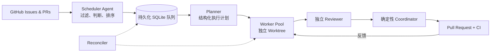

<div align="center">

# Agent-Z

<<<<<<< Updated upstream
[English](README.md)
=======
### 持续把 GitHub Issue 变成经过审查的 Pull Request。

Agent-Z 是面向 coding agent 的开源控制平面：自动发现高价值任务、生成计划、
并行隔离开发、独立审查、创建 PR、等待 CI，并从中断中恢复。

[](https://github.com/fhwangyinan/agent-z/actions/workflows/ci.yml)
[](https://www.python.org/)
[](https://docs.anthropic.com/en/docs/claude-code)
[](https://openai.com/codex/)
[](https://opencode.ai/)
[](https://coderabbit.ai/)

[快速开始](#快速开始) · [工作原理](#工作原理) · [架构](#架构) · [English](README.md)
>>>>>>> Stashed changes

</div>

---

## 为什么需要 Agent-Z？

Coding agent 擅长解决单个任务。让多个 Agent 在真实 backlog 上长期、安全地协作，
则是另一类问题。

Agent-Z 补上了这层调度与治理能力：

| | 能力 | 带来的效果 |
|---|---|---|
| **Agent 语义调度** | Scheduler Agent 判断 Issue 是否值得做、应该先做什么 | Tracking Issue、模糊需求、低收益任务不会粗暴入队 |
| **并行隔离执行** | 每个 Worker 使用独立分支与 Git worktree | 互不依赖的 Issue 可以同时推进 |
| **冲突规避** | Issue、文件与模块级资源声明保护进行中的工作 | 发现潜在重叠时延后任务，而不是让 Worker 相互覆盖 |
| **完整交付闭环** | 规划、开发、审查、提交、等待 CI、修复、再验证 | 最终产物是经过检查的 PR，而不只是一段代码 |
| **持久化恢复** | SQLite 状态、租约、心跳、重试与 Reconciler | 中断的规划可重新排队，废弃开发会进入人工检查 |
| **后端自由组合** | Claude Code、Codex、OpenCode 使用统一 Runner 契约 | 可统一使用一种后端，也可组合 Task Lead 与独立 Reviewer |

## 一条命令，启动完整流水线

```bash
python run.py --serve
```

它会启动 Scheduler、Planner、Reconciler 和可配置的 Worker Pool。全屏 TUI
把进程、任务、事件、耗时和实时日志尾部保持在同一屏中。

```text
┌ Agent-Z Service ─────────────────────────────────────────────────────┐
│ Processes          Tasks                  Selected task / live log   │
│ ● scheduler        #123 planning          stage, lease, events       │
│ ● planner          #118 developing        expandable log tail        │
│ ● worker-1         #104 waiting_checks                               │
│ ● reconciler                                                        │
└─────────────────────────────────────────────────────────────────────┘
```

使用 `Tab` 切换面板，方向键或 `j/k` 选择，`Enter` 或 `Space` 展开详情，
`q` 停止服务。子进程完整日志保存在 `.agent-z/logs/`。

## 工作原理



1. **发现任务**：低成本安全规则排除已分配、已阻塞、正在处理、有重复 PR 或依赖未关闭的 Issue。
2. **语义排序**：Scheduler Agent 自行查看候选 Issue，拒绝不可独立交付的工作，并按预期收益排序。
3. **生成计划**：Task Lead 创建可持久化的结构化执行计划。
4. **隔离执行**：Worker 领取 Issue 与模块资源，并创建专属分支和 worktree。
5. **开发与审查**：Task Lead 延续规划上下文完成开发；独立 Reviewer 将发现反馈给 Developer。
6. **提交交付**：确定性 Coordinator commit、push、创建 PR、等待 checks，并循环处理有效反馈。
7. **故障恢复**：Reconciler 重新排队过期规划租约，并把废弃开发标记为 `needs_human`。

只有候选快照变化或队列需要补位时才会调用 Scheduler Agent。每轮只批量获取一次
open PR，降低 GitHub API 请求与 Agent token 消耗。

## 快速开始

### 环境要求

- Python 3.11+
- 已认证的 [GitHub CLI](https://cli.github.com/)：`gh auth login`
- 至少安装一个 Agent CLI：`claude`、`codex` 或 `opencode`
- 可选：[CodeRabbit](https://coderabbit.ai/) GitHub App

### 安装

```bash
git clone https://github.com/fhwangyinan/agent-z.git
cd agent-z

python -m venv .venv
source .venv/bin/activate       # Linux/macOS
# .venv\Scripts\activate        # Windows PowerShell

pip install -r requirements.txt
cp .env.example .env
```

在 `.env` 中配置目标项目与仓库：

```env
PROJECT_DIR=/path/to/your/project
GITHUB_REPO=owner/repository

DEFAULT_BACKEND=claude
# TASK_LEAD_BACKEND=claude
# REVIEWER_BACKEND=codex
```

启动服务：

```bash
python run.py --serve
```

<<<<<<< Updated upstream
`--serve` 会启动一个 Scheduler、一个 Planner、一个 Reconciler，以及默认
`SERVICE_WORKERS` 个 Worker。任一子进程异常退出后会自动重启；按 `Ctrl+C`
统一停止全部进程。可用 `python run.py --serve --workers 4` 临时覆盖 Worker 数量，
并将本次服务的最大并发任务数设为 4。
默认 `--help` 只展示日常命令；使用 `python run.py --help-all` 查看池级和调参命令。

以下命令用于单任务处理、调试或独立扩缩：
=======
## 为真实仓库而设计

### Agent 决定价值，确定性逻辑保证安全

Scheduler Agent 判断什么值得做；确定性安全检查决定什么可以进入候选。它会跳过
已有 assignee、活动标签、相关 open PR，以及通过 `Blocked by #123`、
`Depends on #123` 或 `Requires #123` 声明的未关闭依赖。

候选 Issue 的 `updatedAt`、open PR 状态和队列状态会持久化。backlog 未变化时不会
反复调用 Agent。GitHub 状态不可用时，新任务入队保持 fail-closed；瞬时查询失败
则不会错误取消已经排队的工作。

### 支持并行，也正视冲突

每个 Run 都有唯一 ID、分支、worktree、计划、流程阶段与角色租约。SQLite 提供
原子队列领取和 Issue 锁；预测文件、实际修改文件与保守模块资源共同减少并行
Worker 的冲突。

Agent-Z 还会在开发前重新检查 GitHub，避免重复处理其他人或自动化已经开始的工作。
如果需要跨机器严格互斥，建议额外配置仓库侧锁或 GitHub Action。

### 失败也是流程状态

GitHub 与网络操作采用有界指数退避重试；Planner 瞬时失败可自动重试；服务子进程
由熔断器保护并自动重启；租约丢失会传播到所属进程；所有关键变化都会写入结构化
事件，便于诊断无人值守任务。

## 日常命令
>>>>>>> Stashed changes

```bash
python run.py --serve              # 启动完整自治服务
python run.py --serve --workers 4  # 使用四个 Worker
python run.py --issue 123          # 无人值守处理单个 Issue
python run.py --enqueue 123        # 加入持久化队列
python run.py --list-runs          # 查看最近与活跃任务
python run.py --inspect RUN_ID     # 查看计划、状态和事件时间线
python run.py --resume RUN_ID      # 恢复中断任务
python run.py --cancel RUN_ID      # 安全取消废弃任务
python run.py --help-all           # 查看池级与调参命令
```

<details>
<summary><strong>全部运行模式</strong></summary>

| 命令 | 用途 |
|---|---|
| `python run.py` | 交互式选题、影响问答和开发 |
| `python run.py --loop N` | 自主执行 N 轮 |
| `python run.py --loop N --force` | 包含高风险 Issue |
| `python run.py --planner` | 持续规划已排队 Issue |
| `python run.py --worker` | 持续执行 ready 任务 |
| `python run.py --scheduler` | 持续发现并入队任务 |
| `python run.py --schedule-once` | 单次调度扫描 |
| `python run.py --reconciler` | 持续恢复过期租约 |
| `python run.py --reconcile-once` | 单次恢复扫描 |
| `python run.py --plan-next` | 单次规划最早排队任务 |
| `python run.py --run-next` | 单次执行最早 ready 任务 |

Planner 与 Worker 进程可以独立扩缩。

<<<<<<< Updated upstream
### TUI 可观测性

终端输出同时适合交互观察和无人值守日志留存：

- 每个关键阶段展示完整 Run ID、Issue 编号、状态、阶段、租约角色和累计耗时。
- Agent 调用展示后端/session 模式与执行耗时。
- Worker、Planner、Scheduler、Reconciler 的空闲倒计时和运行时间在同一行实时刷新，不持续堆积 heartbeat 日志。
- `--serve` 统一显示一条服务存活进程数与运行时间状态；任务、错误和重启事件仍保留为正常日志行。
- Agent 调用会实时显示已运行时间；PR checks 注册等待、检查等待和服务重启会显示动态时间状态。
- PR Checks 使用结果表展示，并包含总等待时间。
- 完成、跳过、失败、中断和 `needs_human` 使用统一终态摘要。
- `--list-runs` 展示带颜色的状态总览、任务年龄、租约、PR 和错误。
- `--inspect RUN_ID` 展示运行详情、持久化计划和带相对时间的事件时间线。

### 交互模式

- 让 Agent 自动推荐 issue，或手动指定编号
- 查看影响评估，与 Analyst 追问讨论
- 输入 `skip` 换 issue，`done` 或回车开始开发

### 自主模式

- Agent 自动推荐并修复 issue，无人值守
- 风险评估：**high / very_high** 跳过（加 `--force` 则忽略）
- 可用参数：

| 参数 | 效果 |
|------|------|
| `--serve` | 启动 Scheduler、Planner、Worker 与 Reconciler 完整服务 |
| `--workers N` | 设置 `--serve` 启动的 Worker 数量 |
| `--loop N` | 自动运行 N 轮 |
| `--force` | 忽略风险级别，全部开发 |
| `--issue N` | 立即执行一个 Issue |
| `--enqueue N` | 将 Issue 加入 SQLite 队列 |
| `--plan-next` | 单次规划最早的排队 Issue |
| `--run-next` | 有空闲并发槽时领取最早的已规划 ready 任务 |
| `--resume RUN_ID` | 恢复失败或中断的任务 |
| `--inspect RUN_ID` | 查看持久化元数据和结构化事件时间线 |
| `--planner` | 启动一个可独立扩缩的 Planner 进程 |
| `--scheduler` | 持续扫描并按优先级入队无阻塞 Issue |
| `--schedule-once` | 执行一次调度扫描 |
| `--worker` | 启动一个可独立扩缩的开发 Worker |
| `--reconciler` | 持续恢复过期 Planner/Worker 租约 |
| `--reconcile-once` | 执行一次过期租约恢复 |
| `--worker-max-runs N` | worker 领取 N 个任务后停止（`0` 表示持续运行） |
| `--keep-worktree` | 成功后保留任务 worktree |

## 工作流

每轮执行：

1. **Issue 调度与入队** — Scheduler 先用确定性规则跳过已有 assignee、活动标签、相关 open PR 或未关闭依赖的 Issue，再只把候选 Issue 编号交给专职 Scheduler Agent，由 Agent 自行通过 `gh` 查看最新正文、标签、引用、相关 PR 和代码，判断候选是否是可独立交付的代码任务，并按预期收益、紧迫度、影响面、置信度、成本、风险和解锁价值排序。Tracking/meta issue、epic、roadmap、讨论、模糊请求等会被拒绝；标签只作为提示。Issue 正文可用 `Blocked by #123`、`Depends on #123` 或 `Requires #123` 声明依赖；互不依赖的高价值 Issue 会批量入队并可并行执行。Agent 输出异常时本轮不会入队，决策会写入事件日志并在每轮重新判断。旧版 Scheduler 已入队但尚未被 Planner 领取的任务也会重新审查；手动入队和已领取任务不会被自动取消。
2. **Task Lead 规划** — 按需探索相关 open Issue/PR，分析 Issue、评估影响、把可读结论写入 Issue，并持久化版本化结构执行计划：
   - `very_low` — 无影响
   - `low` — 轻微影响
   - `medium` — 中等影响
   - `high` — 显著影响（行为/API 变化）→ 自动跳过
   - `very_high` — 破坏性变更（改变流程/输出）→ 自动跳过
   - 已有评估则追加更新，不重复创建
3. **交互问答**（仅交互模式）— 就影响评估与 Analyst 对话；`skip` 换 issue
4. **Worker Preflight** — 开工前重新检查 Issue 状态、label、相关 PR、计划新鲜度和预测文件冲突。
5. **标记已认领** — 开发开始前给 Issue 添加 `SKIP_LABELS` 中的第一个标签
6. **任务隔离** — 为每个任务创建独立分支和 Git worktree
7. **开发修复** — 在同一个 Task Lead session 中继续，并在独立 worktree 中修复代码
8. **本地审查** — 独立 Reviewer 审查；发现的问题显式交给 Developer 修复
9. **提交 PR** — Coordinator 确定性地 commit、push、创建并验证 PR
10. **PR Checks** — 使用 `gh pr checks --watch` 等待全部 checks → Developer 读取 CI 与 review 反馈 → 修复 → 本地 Reviewer 复查通过 → push → 循环直到无需修改
=======
</details>
>>>>>>> Stashed changes

## 架构

```text
run.py                    CLI 入口
config.py                 基于环境变量的配置
orchestration/
  scheduler.py            安全过滤、快照与 Agent 调度
  store.py                SQLite 队列、状态、租约与资源声明
  workflow.py             规划和任务执行状态机
  service.py              完整服务监管与重启熔断
  tui.py                  Rich 实时 Dashboard 与任务检查
  github_ops.py           GitHub 查询、预检、重试与清理
  submission.py           确定性 commit、push、PR 创建与接管
  worktree.py             独立 Git worktree 生命周期
  pools.py                Scheduler、Planner、Worker、Reconciler 循环
agents/
  scheduler.py            Issue 语义判断与排序
  analyst.py              Task Lead 规划与影响分析
  developer.py            实现与 review 反馈处理
  reviewer.py             独立本地 Code Review
  runners/                Claude Code、Codex、OpenCode 适配器
```

Task Lead 在规划与开发间共享上下文，Reviewer 使用独立 session。任务领取、
commit、push、创建 PR 等必须可预测的生命周期操作保持确定性实现。

## 可观测性

- 固定一屏的进程/任务 Dashboard，支持稳定选中项与可展开日志
- Agent 调用、等待、checks 与重启过程实时显示耗时
- 每个 Run 的结构化 SQLite 事件历史与全局服务事件
- 带状态、阶段、租约、年龄、PR 和错误的彩色任务列表
- `.agent-z/logs/` 下按进程保存并轮转日志

<<<<<<< Updated upstream
开发前，Agent-Z 会确认必需的进行中 label 已真正添加。提交阶段由 Task Lead 根据最终 diff 生成 commit message、PR 标题和 PR 描述；Coordinator 校验这些元数据后，确定性地提交残留改动、推送任务分支、调用 `gh pr create`，并通过 GitHub 验证结果。Agent 元数据无效时会使用安全模板兜底。分支上预先存在的 PR 会明确记录为“接管外部 PR”。

完成和取消的任务会移除本任务添加的 active-work label，并清理 worktree。失败和 `needs_human` 任务默认保留分支、label 和 worktree 以便恢复，但仍会释放租约。设置 `CLEANUP_FAILED_WORKTREES=true` 可清理失败 worktree，同时保留分支和 active-work label。

日常发现查询只读取 open 数据：选题只列出 open Issue 和 open PR，Worker preflight 只检查相关 open PR，提交恢复也只接管任务分支上的 open PR。只有已经持有明确 PR URL、确需检查该对象时，才会查询单个历史 PR。

Task Lead 只在需要时通过有针对性、可分页的查询探索 open Issue 和 open PR。Coordinator 不再把 backlog 快照注入 prompt，因此既保留探索灵活性，也避免反复加载仓库全局状态。

结构化事件会写入 SQLite，覆盖队列、worker、阶段、状态、恢复、取消、跳过标签和文件声明等变化。远程或无人值守任务需要诊断时，可用 `python run.py --inspect RUN_ID` 查看时间线。

## 配置

复制 `.env.example` 为 `.env` 后修改。全部选项：

| 变量 | 说明 | 默认值 |
|------|------|--------|
| `PROJECT_DIR` | 目标项目路径 | — |
| `GITHUB_REPO` | 目标仓库 (owner/repo) | — |
| `SKIP_LABELS` | 逗号分隔的跳过标签；开发前会添加第一个标签 | `ongoing` |
| `AGENT_Z_HOME` | 运行状态目录 | `.agent-z` |
| `STATE_DB` | SQLite 状态数据库 | `.agent-z/state.db` |
| `WORKTREE_ROOT` | 独立 worktree 目录 | `.agent-z/worktrees` |
| `DEFAULT_BACKEND` | 默认后端：`claude`、`codex` 或 `opencode` | `claude` |
| `TASK_LEAD_BACKEND` | Issue 选择、规划和开发共享的后端 | `ANALYST_BACKEND` 或 `DEFAULT_BACKEND` |
| `REVIEWER_BACKEND` | Reviewer 后端覆盖 | `DEFAULT_BACKEND` |
| `CLAUDE_FLAGS` | Claude 参数 | `--dangerously-skip-permissions` |
| `CODEX_FLAGS` | Codex 参数 | `--dangerously-bypass-approvals-and-sandbox` |
| `OPENCODE_FLAGS` | OpenCode 参数 | — |
| `TIMEOUT_ANALYST` | Analyst 超时 (秒) | 3600 |
| `TIMEOUT_DEVELOPER` | Developer 超时 (秒) | 10800 |
| `TIMEOUT_REVIEWER` | Reviewer 超时 (秒) | 1800 |
| `RETRY_TIMEOUT` | 重试超时 (秒) | 3600 |
| `GITHUB_RETRY_ATTEMPTS` | GitHub CLI 与显式网络 Git 操作的最大尝试次数 | 3 |
| `GITHUB_RETRY_BASE_DELAY` | 瞬时网络失败首次重试等待秒数 | 2 |
| `GITHUB_RETRY_MAX_DELAY` | 指数退避最大等待秒数 | 30 |
| `GITHUB_COMMAND_TIMEOUT` | 未显式设置 timeout 的单次 GitHub/Git 网络命令超时秒数 | 60 |
| `PR_CHECKS_INTERVAL` | PR Checks watch 间隔 (秒) | 10 |
| `PR_CHECKS_MAX_WAIT` | PR Checks 最大等待 (秒) | 900 |
| `MAX_REVIEW_ROUNDS` | Review 最大轮次 | 5 |
| `MAX_LOCAL_REVIEW_ROUNDS` | 本地 Review 最大轮次 | 5 |
| `MAX_PARALLEL_TASKS` | 跨进程最大活跃任务数 | 2 |
| `SERVICE_WORKERS` | `--serve` 默认启动的 Worker 数量 | `MAX_PARALLEL_TASKS` |
| `SERVICE_RESTART_DELAY` | 服务子进程异常退出后的重启等待秒数 | 5 |
| `MAX_RUN_SECONDS` | 单次执行时间预算 | 21600 |
| `CLEANUP_COMPLETED_WORKTREES` | 成功后删除 worktree | `true` |
| `CLEANUP_FAILED_WORKTREES` | 失败/needs-human 后删除 worktree，但保留分支与 label | `false` |
| `WORKER_IDLE_SLEEP` | 队列 worker 空闲时的 sleep 秒数 | 30 |
| `PLANNER_IDLE_SLEEP` | Planner 无待分析 Issue 时的 sleep 秒数 | 30 |
| `SCHEDULER_IDLE_SLEEP` | Scheduler 扫描间隔秒数 | 60 |
| `SCHEDULER_BATCH_SIZE` | 每轮最多入队的 Issue 数 | 10 |
| `SCHEDULER_ISSUE_LIMIT` | 每轮最多扫描的 open Issue 数 | 100 |
| `SCHEDULER_AGENT_CANDIDATE_LIMIT` | 每轮最多交给 Scheduler Agent 判断的候选数 | `SCHEDULER_ISSUE_LIMIT` |
| `SCHEDULER_ELIGIBLE_LABELS` | 可调度标签；留空表示所有 open Issue | — |
| `SCHEDULER_BLOCK_LABELS` | 阻止自动入队的标签 | `blocked` |
| `SCHEDULER_SKIP_ASSIGNED_ISSUES` | 跳过已有 assignee 的 Issue | `true` |
| `SCHEDULER_PRIORITY_LABELS` | 构建 Agent 候选短名单时使用的优先级标签提示 | `priority:critical,...` |
| `RECONCILER_INTERVAL` | 过期租约扫描间隔秒数 | 60 |
| `PLANNER_LEASE_SECONDS` | Planner 租约时长 | 7200 |
| `WORKER_LEASE_SECONDS` | Worker 租约时长 | 21600 |

旧变量 `CODERABBIT_POLL_INTERVAL` 和 `CODERABBIT_MAX_WAIT` 仍可作为兼容回退。

## 后端选择

全部角色使用同一后端：

```env
DEFAULT_BACKEND=codex
=======
```bash
python run.py --list-runs
python run.py --inspect RUN_ID
>>>>>>> Stashed changes
```

## CI 与自动审查

内置 GitHub Actions 会在 Python 3.11、3.12、3.13 上运行测试，并执行独立编译
检查。Actions 固定到不可变 SHA，Workflow 使用只读仓库权限。

`.coderabbit.yaml` 配置了针对状态迁移、SQLite 原子性、并发、恢复、外部 CLI
调用与测试覆盖的自动审查。安装 CodeRabbit GitHub App 即可启用，无需仓库 Secret。

<details>
<summary><strong>配置参考</strong></summary>

复制 `.env.example` 为 `.env`。模板中记录了全部可用配置，常用项如下：

| 变量 | 用途 | 默认值 |
|---|---|---|
| `PROJECT_DIR` | 目标项目路径 | 必填 |
| `GITHUB_REPO` | `owner/repo` 格式的目标仓库 | 必填 |
| `DEFAULT_BACKEND` | 默认 Agent 后端 | `claude` |
| `TASK_LEAD_BACKEND` | 规划与开发后端 | 默认后端 |
| `REVIEWER_BACKEND` | 独立审查后端 | 默认后端 |
| `MAX_PARALLEL_TASKS` | 最大活跃任务数 | `2` |
| `SERVICE_WORKERS` | `--serve` 启动的 Worker 数量 | 最大并发数 |
| `SCHEDULER_BATCH_SIZE` | 每轮最多入队 Issue 数 | `10` |
| `SCHEDULER_ELIGIBLE_LABELS` | 必需调度标签；留空允许全部 | 空 |
| `SCHEDULER_BLOCK_LABELS` | 阻止调度的标签 | `blocked` |
| `SKIP_LABELS` | 活动标签；开发前添加第一个 | `ongoing` |
| `GITHUB_RETRY_ATTEMPTS` | GitHub/Git 网络操作尝试次数 | `3` |
| `MAX_REVIEW_ROUNDS` | 远程 review 修复最大轮次 | `5` |

完整列表见 [`.env.example`](.env.example)。

</details>

## 项目状态

Agent-Z 正在持续演进。它适合已经信任 Agent CLI 修改代码，并希望为其增加持久化、
可观测工作流的仓库。建议先检查默认后端参数，并在受限仓库或通过 eligible label
控制范围后，再开启大范围自动调度。

---

<div align="center">

让 coding agent 完成整个工作流，而不只是开始写代码。

</div>
